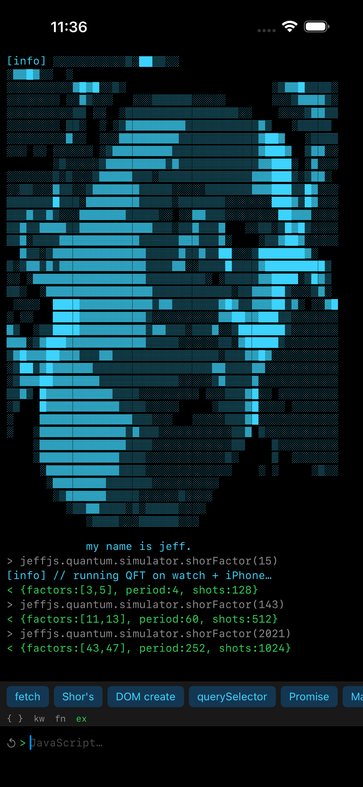
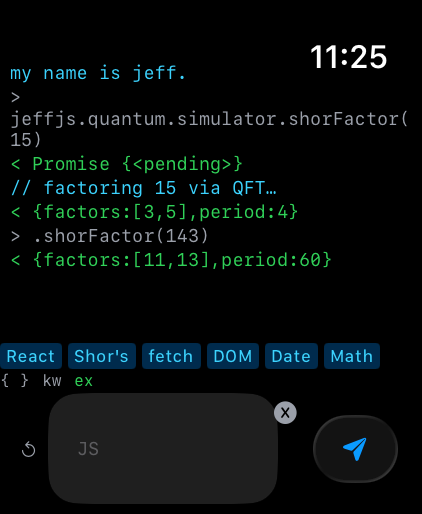
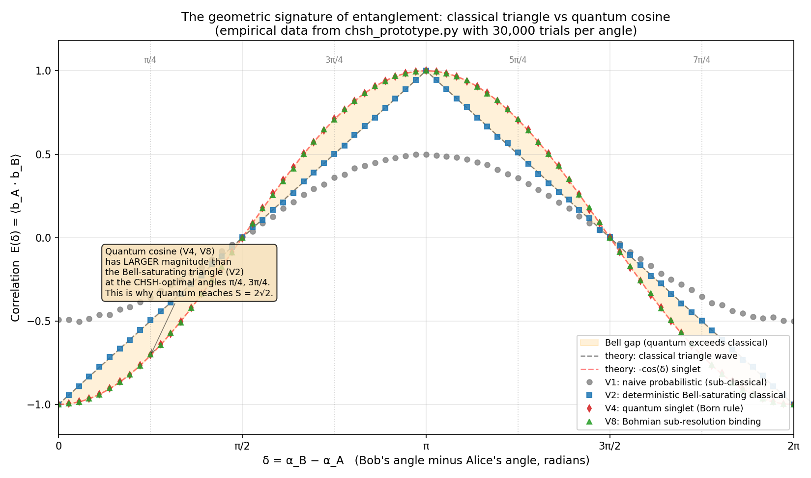
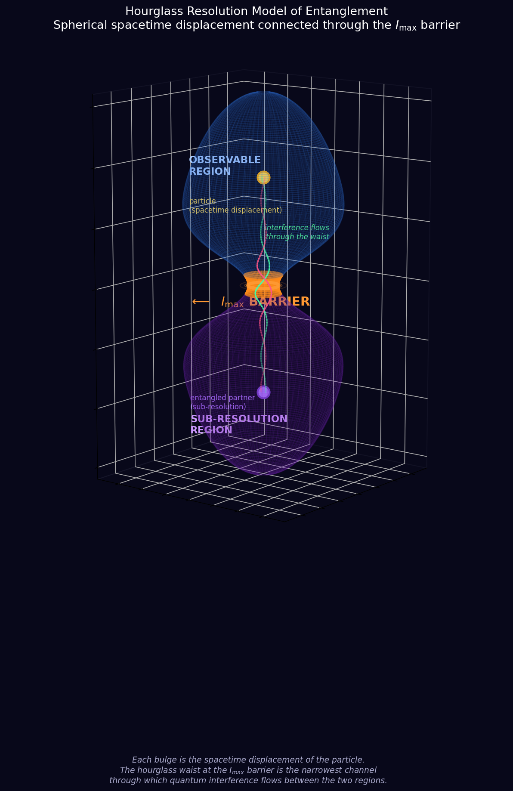

# JeffJS

> **A pure-Swift JavaScript engine.** A 1:1 port of [QuickJS](https://bellard.org/quickjs/) into ~70k lines of Swift, with a built-in DOM, fetch, IndexedDB, WebSockets, GPU-accelerated GC and regex via Metal, and an experimental quantum encoder.

<p align="center">
  <a href="https://apps.apple.com/us/app/jeffjs-console/id6763829201">
    
  </a>
  &nbsp;&nbsp;
  <a href="https://apps.apple.com/us/app/jeffjs/id6763828438">
    
  </a>
</p>

<p align="center">
  <strong>The whole engine is open source — clone it, build it, ship it.</strong><br>
  Want to support the project? Grab the official app on the App Store:<br>
  <a href="https://apps.apple.com/us/app/jeffjs-console/id6763829201"><strong>JeffJS Console</strong></a>
  <em>— iPhone · iPad · Mac · Vision Pro</em>
  &nbsp;·&nbsp;
  <a href="https://apps.apple.com/us/app/jeffjs/id6763828438"><strong>JeffJS</strong></a>
  <em>— Apple Watch</em>
</p>

<p align="center"><em>Yes — that means you can run <strong>Shor's algorithm</strong> (and a dozen other quantum primitives) on your wrist.</em></p>

```swift
import JeffJS

let env = JeffJSEnvironment()
env.onConsoleMessage = { level, msg in print("[\(level)] \(msg)") }

env.eval("""
    const xs = [1, 2, 3, 4, 5];
    console.log(xs.map(x => x * x).reduce((a, b) => a + b));
""")
// [log] 55
```

JeffJS runs everywhere Swift runs — **iOS, macOS, watchOS, tvOS, and visionOS** — with no JavaScriptCore, no V8, no C dependencies. The whole engine is Swift source you can step through in Xcode.

---

## Why JeffJS

Apple already ships JavaScriptCore. JeffJS exists because *that's not enough*:

- **Pure Swift, end-to-end.** No `JSC.framework`, no FFI, no opaque blobs. Every opcode, every GC phase, every regex instruction is Swift you can read, breakpoint, and modify. The whole engine is in `Sources/JeffJS/`.
- **Embeddable everywhere — including watchOS.** JavaScriptCore isn't available on watchOS. JeffJS is. The `JeffJSConsole` sample app ships an Apple Watch target that runs full JavaScript on your wrist.
- **Browser-shaped runtime out of the box.** `JeffJSEnvironment` boots a `window` / `document` / `fetch` / `localStorage` / `IndexedDB` / `WebSocket` world without you wiring anything up. Drop in a script and it runs the way scripts expect to run.
- **GPU acceleration where it matters.** Bacon–Rajan cycle collection runs as Metal compute kernels above ~5,000 live objects. Regex matching can dispatch an NFA to the GPU and test every starting position in parallel.
- **A teaching artifact in the source tree.** The `Quantum/` module is an honest, working playground for procedural fields and lazy evaluation — read its [README](Sources/JeffJS/Quantum/README.md) and push on the math.
- **1:1 with QuickJS.** Almost every file references the QuickJS source it ports. If you know QuickJS internals, you already know your way around JeffJS.

---

## Highlights

| | |
|---|---|
| **Language coverage** | ES2023: classes, modules, generators, async/await, destructuring, spread, template literals, optional chaining, nullish coalescing, BigInt, Symbol, Proxy, WeakRef, TypedArrays, RegExp with named capture groups |
| **Runtime** | Bytecode compiler + interpreter, shape-based inline caches, atom table, bytecode cache (`.jfbc`), Bacon–Rajan cycle GC |
| **Standard library** | Full `Object` / `Array` / `String` / `Number` / `Math` / `Date` / `JSON` / `Map` / `Set` / `Promise` / `Error` / `Atomics` / `Iterator` builtins |
| **Browser surface** | `window`, `document`, `console`, `fetch`, `localStorage` / `sessionStorage`, `IndexedDB`, `WebSocket`, `setTimeout` / `setInterval`, `performance`, `crypto`, `TextEncoder` / `TextDecoder`, `URL`, `MessageChannel`, `structuredClone`, `queueMicrotask`, `atob` / `btoa`, dynamic `import()` |
| **DOM** | HTML tokenizer + parser, full DOM tree, CSS selectors, events, mutation callbacks, computed styles |
| **GPU** | Metal-backed garbage collector, Metal-backed regex NFA, Metal-backed quantum search |
| **Platforms** | iOS 16+, macOS 13+, watchOS 9+, tvOS 16+, visionOS 1+ |

---

## Installation

JeffJS is a Swift package. Add it in Xcode (`File → Add Package Dependencies…`) or in your `Package.swift`:

```swift
dependencies: [
    .package(url: "https://github.com/jbachand/JeffJS.git", from: "1.0.0"),
],
targets: [
    .target(
        name: "YourApp",
        dependencies: [
            .product(name: "JeffJS", package: "JeffJS"),
        ]
    ),
]
```

Then `import JeffJS` and you're done. There are no system dependencies — the package is self-contained Swift plus a handful of Metal compute shaders.

---

## Quickstart

### 1. Just evaluate some JavaScript

```swift
import JeffJS

let env = JeffJSEnvironment()
let result = env.eval("Math.sqrt(2) ** 2")

switch result {
case .success(let str): print(str ?? "undefined")  // "2.0000000000000004"
case .exception(let err): print("error:", err)
}
```

### 2. Hook console output

```swift
env.onConsoleMessage = { level, message in
    print("[\(level)] \(message)")
}

env.eval("""
    console.log('hello from JS');
    console.warn('watch out');
    console.error(new Error('oh no'));
""")
```

### 3. Async / await with `fetch`

```swift
let env = JeffJSEnvironment()

env.eval("""
    async function go() {
        const r = await fetch('https://api.example.com/items');
        const data = await r.json();
        console.log(JSON.stringify(data).slice(0, 100));
    }
    go();
""")
```

`fetch`, dynamic `import()`, `WebSocket`, `IndexedDB`, and timers all work the way the spec says they should — they run their work off the main thread and resolve their Promises through the JS event loop.

### 4. Drive the DOM

```swift
let env = JeffJSEnvironment()

env.eval("""
    const div = document.createElement('div');
    div.innerHTML = '<h1>Hello JeffJS</h1>';
    document.body.appendChild(div);
    document.querySelector('h1').textContent;
""")
// .success("Hello JeffJS")
```

You also get the live `DOMNode` tree on the Swift side via `env.document`, plus an `onDOMMutation` callback when JS mutates it.

### 5. Custom configuration

```swift
let config = JeffJSEnvironment.Configuration(
    baseURL: URL(string: "https://example.com")!,
    userAgent: "MyApp/1.0",
    viewportWidth: 1024,
    viewportHeight: 768,
    storageScope: "my-app",
    startupScripts: [
        "globalThis.greet = (name) => `hello, ${name}`;"
    ]
)
let env = JeffJSEnvironment(configuration: config)
env.eval("greet('world')")  // .success("hello, world")
```

---

## Architecture

```
Sources/JeffJS/
├── Core/         Runtime, Context, GC, Object/Shape/Value/Atom/String — the engine heart
├── Parser/       Tokenizer + recursive-descent parser → AST
├── Bytecode/     AST → bytecode compiler, interpreter, opcode table, .jfbc serializer
├── Builtins/     Object, Array, String, Number, Date, JSON, Map, Set, Promise, …
├── StdLib/       console, timers, performance, URL, atob/btoa, structuredClone, …
├── Environment/  JeffJSEnvironment — turnkey browser-shaped runtime
├── DOM/          HTML parser, DOM tree, CSS selectors, events, fetch, WebSocket, IndexedDB, video, dynamic import bridges
├── RegExp/       Bytecode regex engine + Metal GPU NFA matcher
├── Unicode/      ES-spec Unicode tables
├── Quantum/      Experimental qubit-field encoder (see Sources/JeffJS/Quantum/README.md)
├── Resources/    Metal shaders + JeffJSConfig.plist
└── Utils/        dtoa, list utilities, C interop helpers
```

The pipeline is the QuickJS pipeline: source → tokens → AST → bytecode → interpreter, with shape-based property caches and a Bacon–Rajan cycle collector. Read any file in `Core/` and you'll find a comment pointing at its QuickJS counterpart.

### Metal GPU acceleration

JeffJS opportunistically lifts hot work onto the GPU on Apple Silicon:

| Subsystem | Threshold | What it does |
|---|---|---|
| **GC** (`JeffJSMetalGC`) | > 5,000 live objects | Three Metal kernels run trial-decref → scan-rescue → collect-dead. Object graph is uploaded zero-copy on Apple Silicon. |
| **RegExp** (`JeffJSMetalRegex`) | Long inputs | Compiles the pattern to a flat NFA instruction set and tests every starting position in parallel. |
| **Quantum** (`QuantumGPU`) | Always when available | Three kernels — slice search, exact search, search-and-trace — parallelize the chain encoder across the thread grid. |

All Metal paths are wrapped in `#if canImport(Metal)` so the engine still builds and runs (CPU fallback) on platforms without it.

### Bytecode cache

Compiled functions can be serialized to a portable `.jfbc` format with an atom remapping table, so a JeffJSRuntime can pre-load bytecode without re-parsing source. See `Bytecode/JeffJSBytecodeCache.swift`. Toggle via `cache.bytecodeEnabled` in the config plist.

---

## The Quantum module

Two distinct things live under `window.jeffjs.quantum`. Both are usable from any `JeffJSEnvironment` — including the watchOS app.

- **`.simulator`** — a real state-vector simulator (≤ ~12 qubits), a stabilizer simulator that scales past a thousand qubits, Bell / CHSH experiments, and a handful of working textbook algorithms.
- **`.slice` and `.chain`** — the experimental "qubit-field" encoders. Honest teaching artifact about locality, **not crypto, not compression.** Read [the paper](Sources/JeffJS/Quantum/paper.md) and the [Quantum README](Sources/JeffJS/Quantum/README.md).

### Quantum algorithms — yes, on your wrist

<table>
<tr><th width="42%">Algorithm</th><th>JavaScript</th></tr>

<tr><td>

**Shor's algorithm** — factor an integer using QFT period-finding.

</td><td>

```js
const r = await jeffjs.quantum.simulator.shorFactor(15);
// { factors: [3, 5], N: 15, numQubits: 8, numTrials: 128 }
```

</td></tr>

<tr><td>

**Deutsch–Jozsa** — distinguish constant from balanced functions in one query.

</td><td>

```js
const r = await jeffjs.quantum.simulator.deutschJozsa(4, 'balanced');
// { isConstant: false, measurements: [1, 0, 1, 1] }
```

</td></tr>

<tr><td>

**Bernstein–Vazirani** — recover an N-bit secret string in a single oracle call.

</td><td>

```js
const r = await jeffjs.quantum.simulator.bernsteinVazirani('10110');
// { recovered: '10110' }
```

</td></tr>

<tr><td>

**Quantum teleportation** — send a qubit state via a Bell pair + 2 classical bits.

</td><td>

```js
const r = await jeffjs.quantum.simulator.teleport();
// { success: true, bobOutcome: 1 }
```

</td></tr>

<tr><td>

**Superdense coding** — send 2 classical bits with 1 qubit and a shared Bell pair.

</td><td>

```js
const r = await jeffjs.quantum.simulator.superdenseCoding(1, 0);
// { success: true, sent: [1,0], received: [1,0] }
```

</td></tr>

<tr><td>

**3-qubit error correction** — flip a bit, detect the syndrome, undo the flip.

</td><td>

```js
const r = await jeffjs.quantum.simulator.errorCorrection(1);
// { corrected: true, errorQubit: 1, syndrome: [1,0] }
```

</td></tr>
</table>

### Build your own circuit

<table>
<tr><th width="42%">Operation</th><th>JavaScript</th></tr>

<tr><td>

State-vector circuit (≤ ~12 qubits). Gates: `h`, `x`, `y`, `z`, `s`, `t`, `tdagger`, `cnot`, `phase`.

</td><td>

```js
const sim = jeffjs.quantum.simulator;
const id = sim.createCircuit(2);
sim.gate(id, 'h', { qubit: 0 });
sim.gate(id, 'cnot', { control: 0, target: 1 });
sim.measureAll(id);   // [0,0] or [1,1] — Bell pair
sim.destroyCircuit(id);
```

</td></tr>

<tr><td>

**Stabilizer simulator** — Clifford-only, polynomial in qubit count, scales past 1000 qubits.

</td><td>

```js
const id = sim.createStabilizer(1000);
sim.stabBellPair(id, 0, 1);
sim.stabGHZ(id, [0, 1, 2, 3, 4]);
sim.stabMeasure(id, 0);
sim.destroyStabilizer(id);
```

</td></tr>

<tr><td>

**CHSH / Bell tests** — compare classical bound (S=2) to Tsirelson's bound (S≈2.83).

</td><td>

```js
sim.chsh('boundQubitPair', 10000);
// { S: 2.823, noSignaling: true, variant: 'boundQubitPair', numTrials: 10000 }
sim.ghzCorrelation(3, [Math.PI/2, Math.PI/2, Math.PI/2], 10000);
// 0.998
```

</td></tr>
</table>

<p align="center">
  
  <br>
  <em>The gap above the classical line is the quantum advantage, in numbers — measured live by the simulator.</em>
</p>

### Encoders — the qubit-field experiment

<table>
<tr><th width="42%">Encoder</th><th>JavaScript</th></tr>

<tr><td>

**Slice encoder** — multi-key envelope, no length cap. Each "slice" is a 25-bit address into a deterministic qubit field.

</td><td>

```js
const env = jeffjs.quantum.slice.encode('Hello, world!');
jeffjs.quantum.slice.decode(env);     // 'Hello, world!'

// Inspect the raw addresses
jeffjs.quantum.slice.encodeRaw('hi');
// { keys: ['0x1A2B3C4', ...], length: 2, seedOffset: 0 }
```

</td></tr>

<tr><td>

**Chain encoder** — resolution-deepening octree walk, one 64-hex master key for ≤ 6 chars. Async because it can backtrack.

</td><td>

```js
const k = await jeffjs.quantum.chain.encodeAsync('Hi');
await jeffjs.quantum.chain.decodeAsync(k);   // 'Hi'
```

</td></tr>
</table>

<p align="center">
  
  <br>
  <em>The chain encoder walks an octree of resolutions — coarse to fine and back — collapsing the entire path into a single key. The shape is the hourglass.</em>
</p>

The whole subsystem is gated on `quantum.enabled` in `JeffJSConfig.plist` and disabled cleanly in environments that don't want it.

---

## JeffJSConsole — the sample app

`JeffJSConsole/` is an Xcode project containing four targets that all link `JeffJS`:

- **JeffJSConsole** — iOS, iPad, macOS, and visionOS REPL with command history, dot-completion, an inline ghost-text suggestion buffer, persisted user globals, and a JS keyboard accessory bar.
- **JeffJS Watch App** — the same JavaScript engine, on your wrist. (JavaScriptCore won't run on watchOS. JeffJS does.)
- **JeffJS Watch Widget** — a WidgetKit extension that shows the most recent eval result on your watch face.

Open `JeffJSConsole/JeffJSConsole.xcodeproj` in Xcode and run any target.

---

## Configuration

All engine flags live in [`Sources/JeffJS/Resources/JeffJSConfig.plist`](Sources/JeffJS/Resources/JeffJSConfig.plist). Highlights:

| Key | Default | Purpose |
|---|---|---|
| `optimize.enabled` | `true` | Master switch for the bytecode optimizer. |
| `optimize.shortOpcodes` | `true` | Use short-form opcodes where possible. |
| `cache.bytecodeEnabled` | `false` | Persist compiled bytecode to disk. |
| `cache.bytecodeMaxSize` | `1000000` | Maximum cached bytecode size (bytes). |
| `stack.maxCallDepth` | `200` | JS call stack depth limit. |
| `stack.defaultSize` | `1048576` | Per-context stack buffer size. |
| `gc.mallocThreshold` | `262144` | Bytes allocated before a GC pass triggers. |
| `gc.metalThreshold` | `5000` | Object count above which the GPU GC takes over. |
| `regex.metalThreadGroupSize` | `256` | Metal regex thread group width. |
| `security.blockRemoteImports` | `false` | Refuse `import()` of remote URLs. |
| `quantum.enabled` | `true` | Install `window.jeffjs.quantum` in `JeffJSEnvironment`. |
| `quantum.preferGPU` | `true` | Use Metal for quantum search when available. |

Read them from Swift via `JeffJSConfig.optimizeEnabled`, `JeffJSConfig.gcMetalThreshold`, etc.

---

## Testing

The test target lives in `Tests/JeffJSTests/`:

- `JeffJSTestRunner.swift` — a self-contained runner with **90+ test groups** covering every major language feature: arithmetic, strings, arrays, classes, generators, async/await, modules, regex, Map/Set/WeakRef, Proxy, Symbol, TypedArrays, BigInt, the entire opcode surface, plus regression tests for every spec-compliance fix and a critical subset of test262.
- `JeffJSPerfTests.swift` — micro-benchmarks for hot paths.
- `QuantumTests.swift` — round-trip tests for the quantum encoder/decoder, both slice and chain variants.

Run them via SwiftPM:

```sh
swift test
```

Or run the same test runner inside the `JeffJSConsole` app target — it streams results into the in-app console.

---

## Project layout

```
.
├── Package.swift                  SwiftPM manifest (iOS 16, macOS 13, watchOS 9, tvOS 16, visionOS 1)
├── Sources/JeffJS/                The engine
├── Tests/JeffJSTests/             Test runner, perf tests, quantum tests
├── JeffJSConsole/                 Xcode project: REPL app + Watch app + Watch widget
├── Quantum/                       Visualizations (qubit field GIF + still)
└── Screenshots/                   Console screenshots
```

---

## Contributing

This is, fundamentally, one person's port. PRs are welcome but the bar is **fidelity to QuickJS**: if you're touching `Core/`, `Parser/`, `Bytecode/`, or any builtin, the change should be defensible against the QuickJS source it ports. New surface (DOM bridges, Web APIs, Metal kernels, the Quantum module) has more latitude — open an issue first if it's a big one.

Ground rules:

- **No new external dependencies.** The package is intentionally `import Foundation` and (optionally) `import Metal`. Keep it that way.
- **Tests for everything that touches the language.** Add a case to `JeffJSTestRunner` or to one of the focused test files. `swift test` must stay green.
- **Comment what's non-obvious.** The QuickJS port is dense; future readers (including future-you) will thank you.

---

## Acknowledgements

- **[QuickJS](https://bellard.org/quickjs/)** by Fabrice Bellard — the engine JeffJS is a port of. Every clever idea here belongs to that source tree; the bugs are mine.
- **[test262](https://github.com/tc39/test262)** — the conformance suite the spec compliance tests draw from.
- **Apple Metal team** — for making it possible to write a regex matcher and a garbage collector as compute kernels in two afternoons.

---

## License

Copyright © 2026 Jeff Bachand. License TBD — see `LICENSE` once published.

JeffJS is a derivative work of QuickJS (MIT) and ports significant portions of its design and source. Any release will preserve the QuickJS attribution.

---

*my name is jeff.*
